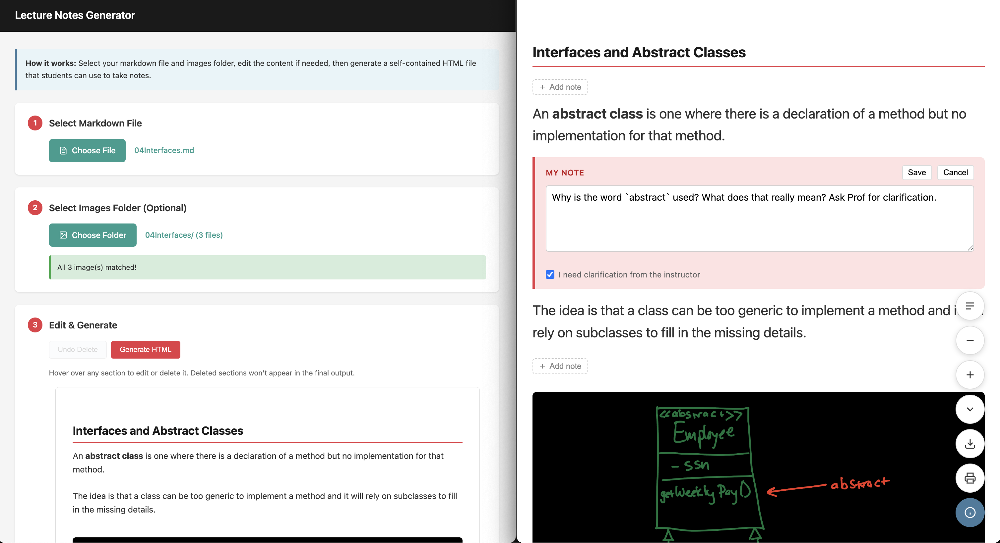

# Lecture Notes Tool

A web-based tool that converts markdown lecture notes into interactive HTML pages where students can add their own private annotations.

**[Try it live →](https://markm208.github.io/vibeCodingInClassTools/note-taking-tool.html)**

## Why?

- You prefer markdown over PowerPoint for lecture notes
- You want students to have clean, readable content with syntax-highlighted code
- You want students to take notes directly alongside your content
- You need something simple—no accounts, no servers, no setup

## How It Works

### For Instructors

1. Open the tool in your browser
2. Upload your markdown file (and optionally an images folder)
3. Preview and remove any sections you don't want
4. Click "Generate HTML" to download a self-contained webpage
5. Share the HTML file with students via your LMS

### For Students

Students open the HTML file in their browser and can:

- **Add notes** after any section (paragraph, code block, heading, etc.)
- **Mark notes** as "needs clarification" to flag questions
- **Expand/collapse** individual notes or all at once
- **Adjust font size** for easier reading or projection
- **Navigate** via table of contents (shows which sections have notes)
- **Export** an HTML snapshot with all notes embedded
- **Print** to PDF with notes included

Notes are stored in the browser's localStorage—private, offline, and invisible to instructors.

## Features

- **Self-contained HTML**: No external dependencies needed to view
- **Syntax highlighting**: Code blocks are highlighted using highlight.js
- **Responsive design**: Works on desktop and mobile
- **Floating toolbar**: Compact controls that stay out of the way
- **Scalable fonts**: 70% to 250%, including code blocks
- **Base64 images**: Images are embedded directly in the HTML
- **Unique storage**: Each lecture file has isolated note storage

## Screenshots

The left side shows the lecture content, while the right side shows student notes. The floating toolbar is in the bottom-right corner.


## Local Development

No build step required. Just open `index.html` in a browser.

## File Structure

```
noteTakingTool/
├── README.md              # This file
├── CLAUDE.md              # Detailed specification
└── index.html             # The converter tool
```

## Tech Stack

- Vanilla HTML/CSS/JavaScript
- [marked.js](https://marked.js.org/) for markdown parsing
- [highlight.js](https://highlightjs.org/) for syntax highlighting

## License

MIT

## Contributing

Issues and pull requests welcome!
